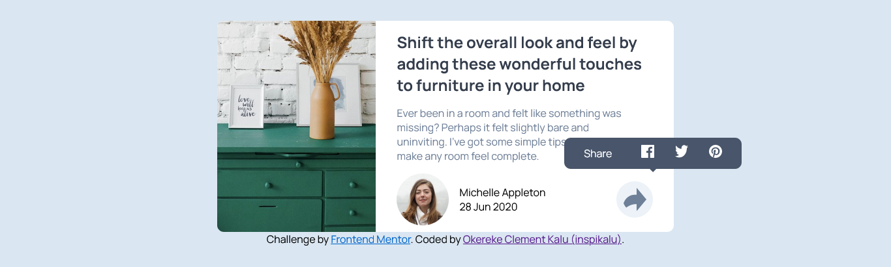

# Frontend Mentor - Article preview component solution

This is a solution to
the [Article preview component challenge on Frontend Mentor](https://www.frontendmentor.io/challenges/article-preview-component-dYBN_pYFT).
Frontend Mentor challenges help you improve your coding skills by building realistic projects.

## Table of contents

- [Overview](#overview)
    - [The challenge](#the-challenge)
    - [Screenshot](#screenshot)
    - [Links](#links)
- [My process](#my-process)
    - [Built with](#built-with)
    - [What I learned](#what-i-learned)
    - [Continued development](#continued-development)
    - [Useful resources](#useful-resources)
- [Author](#author)

## Overview

### The challenge

Users should be able to:

- View the optimal layout for the component depending on their device's screen size
- See the social media share links when they click the share icon

### Screenshot

### Links

- Solution URL: [Solution URL here](https://github.com/inspikalu/article-preview-component-master)
- Live Site URL: [Live site URL](https://article-preview-component-master-tawny-eta.vercel.app)

## My process

### Built with

- Semantic HTML5 markup
- CSS custom properties
- Flexbox
- CSS Grid
- Mobile-first workflow
-

### What I learned

I just discovered the CSS `clamp()` function, and it's a game-changer! With clamp(), I can set a value range for
properties like width or font size. By specifying a minimum, preferred, and maximum value, the browser automatically
selects the best value based on available space. It's perfect for responsive designs that adapt to different screen
sizes. Excited to explore more possibilities with `clamp()`!

### Continued development

In future projects, I will continue building my responsive web design skills while working with some
HTML and Css tools like `clamp()` and media queries

### Useful resources

- [MDN Clamp() Documentation](https://developer.mozilla.org/en-US/docs/Web/CSS/clamp) - This helped to understand the
  concept of clamp and i love how they simplified everything on the documentation

## Author

- Frontend Mentor - [@inspikalu](https://www.frontendmentor.io/profile/inspikalu)
- Twitter - [@inspikalu](https://www.twitter.com/inspikalu)
